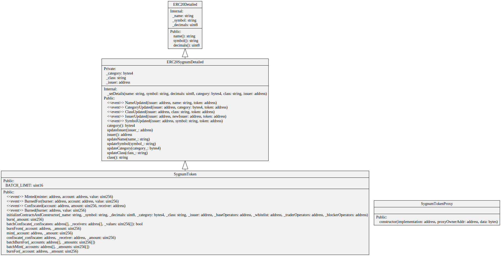
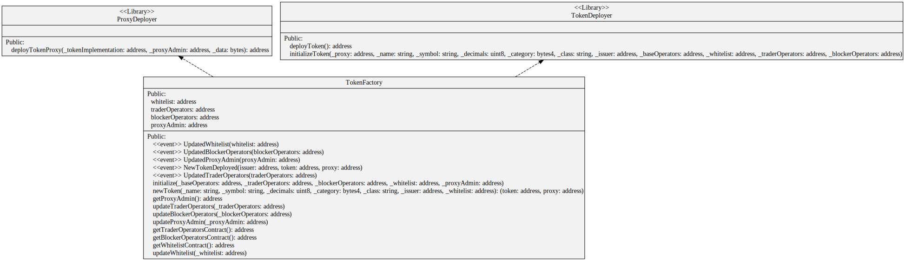
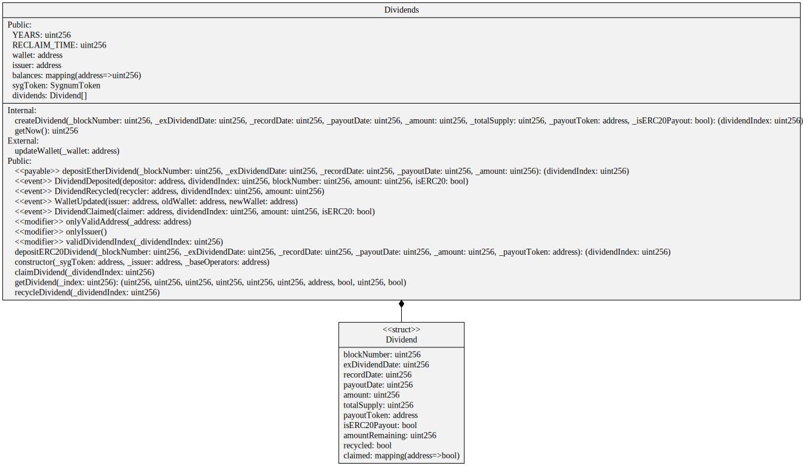

[Mirrored from our internal VCS @ commit hash 98644c48670d35880944e3fed55c706ada378d2c]
# Solidity-Security-Token-Contracts

**Secure Security Token Smart Contracts and Dividends Management**

Built on a solid foundation of community-vetted code, utilizing [OpenZeppelin industry standards](https://github.com/OpenZeppelin/openzeppelin-contracts).

 * [Sygnum Security Token](contracts/token/SygnumToken.sol) is built using [function overloading](https://solidity.readthedocs.io/en/v0.4.21/contracts.html#function-overloading) principles from [polymorphism](https://en.wikipedia.org/wiki/Polymorphism_(computer_science)) within [ERC20 functions](hhttps://gitlab.com/sygnum/blockchain-engineering/ethereum/solidity-base-contracts/-/tree/develop/contracts/helpers/ERC20).
 * Utilizes [role-based permissioning](https://gitlab.com/sygnum/blockchain-engineering/ethereum/solidity-base-contracts/-/tree/develop/contracts/role) scheme and a [whitelist](https://gitlab.com/sygnum/blockchain-engineering/ethereum/solidity-base-contracts/-/blob/develop/contracts/helpers/Whitelist.sol) from [solidity-base-contracts repo](https://gitlab.com/sygnum/blockchain-engineering/ethereum/solidity-base-contracts/) to ensure a setup in line with regulatory requirements.
 * Comes with a [TokenFactory](contracts/factory/TokenFactory.sol) useful to deploy and configure both the [SygnumToken](contracts/token/SygnumToken.sol) and its direct interface, the [SygnumTokenProxy](contracts/token/SygnumTokenProxy.sol), useful for  upgradability features and conceived with the modern [OpenZeppelin standards](https://docs.openzeppelin.com/upgrades/2.7/proxies).
 * Features a [blocked balance](https://gitlab.com/sygnum/blockchain-engineering/ethereum/solidity-base-contracts/-/blob/develop/contracts/helpers/ERC20/ERC20Blockable.sol) in addition to the standard ERC20 balance (which becomes the available balance) which is useful to block tokens (e.g. for orders on secondary markets) without the need to move them into a separate escrow contract and hence maintain the current ownership.
 * Includes a [Dividends contract](contracts/dividends/Dividends.sol) that allows to manage and distribute dividends (or any other payments) among token holders in a decentralized and autonomous fashion.
 * Audited by [Quantstamp](https://quantstamp.com/) with no major vulnerabilities.

## Overview

The [Sygnum Security Token](contracts/token/SygnumToken.sol) is an ERC20 based smart contract built on the Ethereum network for issuing tokens to be used in a regulated environment. The token has been designed and built by Sygnum Bank AG’s Blockchain Engineering and Tokenization team.

The [Sygnum Security Token](contracts/token/SygnumToken.sol) was specifically designed for tokenizing assets in a banking-grade solution. Building on top of the ERC20 interface, it is extended with a broad role model and features that enables trading on regulated exchanges, such as an additional balance for blocked funds as well as trading on behalf of clients. The [Sygnum Security Token](contracts/token/SygnumToken.sol) is equipped with extensions to fulfill regulatory requirements, such as a whitelist and functions that enable the service provider to intervene if necessary. The [Dividends](contracts/dividends/Dividends.sol) extension allows distribution of payments such as dividends or bond coupons in ETH or any ERC20 token to token holders in a seamless fashion. 

To accommodate for adaptability and an environment of ever-changing customer demands the token is also equipped with a [proxy](contracts/token/SygnumTokenProxy.sol) contract based on the OpenZeppelin standards. This enables a future-proof setup with the possibility upgrade the token functionality without the need to deploy a new contract.

The token is initialized with a whitelist contract, role contracts (base, trader, blockers) and a proxy admin address.

### Functions

An overview of the most important extensions of the [Sygnum Security Token](contracts/token/SygnumToken.sol) can be found below.

`mint`: increase the supply by minting a specified amount of tokens to an address. Alternatively, `batchMint` can be used to mint up to 256 addresses in a single batch. Can only be called by Operator or System.

`burn`: decrease the supply by a specified amount from the account of msg.sender. Alternatively, `burnFor` can be used to burn an amount of tokens for a specific address. Can only be called by Operator or System.

`pause`: halt all interactions with the smart contract by pausing the token. Can only be called by Operator.

`unpause`: re-enable interactions with the smart contract by unpausing a paused token. Can only be called by Operator.

`freeze`: stop a particular address from interacting with the smart contract. Can only be called by Operator. This function can be used to carry out enforcements of court rulings or other situations where regulations require intervention of the service provider (e.g. AML). It also enables tokenization use cases with transfer restrictions.

`unfreeze`: re-enable a particular frozen address to interact with the smart contract. Can only be called by Operator.

`confiscate`: transfer a specified amount of tokens from one address to a target address. Alternatively, `batchConfiscate` can be used to combine up to 256 confiscations in a single batch. Can only be called by Operator. This function can be used to carry out enforcements of court rulings or other situations where regulations require intervention of the service provider (e.g. AML).

`block`: transfer a specified amount of tokens from an account’s available balance ( `balanceOf()` ) to its blocked balance ( `blockedBalanceOf()` ). Can only be called by Blocker or Operator. This function can be used to block funds which are “in order” on a secondary market or held in escrow for other purposes (e.g. lending services), while at the same time ensuring that the tokens remain in the account and name of the token holder. This helps to achieve legal clarity in terms of ownership, which can be critical for tokens that constitute a security (e.g. shares).

`unblock`: transfer a specified amount of tokens from an account’s blocked balance ( `blockedBalanceOf()` ) to its available balance ( `balanceOf()` ). Can only be called by Blocker or Operator. 

`destroy`: remove a token by destroying the smart contract. Can only be called by Operator. This function can be used in case of termination of the underlying tokenization use case (e.g. insolvency of a company or expiry of a fixed income product).

`depositERC20Dividend`: define a specified amount of any ERC-20 token to be deposited in the smart contract, defining point in time (`totalSupplyAt`) which should be used to determine the eligibility of token holders for a claim. Alternatively, `depositEtherDividend` can be used to setup a distribution in Ether. Can only be called by Issuer.

`claimDividend`: claim the amount of tokens or Ether of the deposited dividend that the caller is entitled to according to her holdings in proportion to the total supply at the time of the snapshot defined by the Issuer. Can be called by any whitelisted address with a claim.

`updateName`: change the name of the token, in case of a rebranding or renaming of the underlying asset. Can only be called by Operator.

`updateSymbol`: change the symbol of the token, for example in case of a rebranding or renaming of the underlying asset. Can only be called by Operator.

`updateCategory`: change the category of the token, for example in case the token is converted from a bond into shares. Can only be called by Operator.

`updateClass`: change the class of the token, for example in case the general assembly decides to restructure the underlying share class from preferred to common. Can only be called by Operator.

`updateIssuer`: change the issuer address associated with the token. Useful in cases where off-chain transactions such as mergers need to be reflected on-chain. Can only be called by Operator.


### Installation

Note: for now this repo only works with NodeJS 10.

Obtain a [gitlab access token](https://docs.gitlab.com/ee/user/profile/personal_access_tokens.html). Using the `api` scope should suffice.

```console
# Set URL for your scoped packages.
# For example package with name `@sygnum/solidity-edge-dchf-contracts` will use this URL for download
npm config set @sygnum:registry https://gitlab.com/api/v4/packages/npm/

# Add the token for the scoped packages URL. This will allow you to download
# `@sygnum/` packages from private projects.
npm config set '//gitlab.com/api/v4/packages/npm/:_authToken' "<your_access_token>"
```

Now you are able to install all the dependencies as well as the private npm packages within the @sygnum gitlab org.
```console
npm i
```

### Usage

Once installed, you can edit the contracts in the folder and if you need to import from the [Sygnum security token library](https://gitlab.com/sygnum/blockchain-engineering/ethereum/solidity-equity-token-contracts) you can simply import them as:

```solidity
pragma solidity 0.5.12;

import "@sygnum/solidity-equity-token-contracts/contracts/token/SygnumToken.sol";

contract MyContract is SygnumToken {
    constructor() public {
    }
}
```

To keep your system secure, you should **always** use the installed code as-is, and neither copy-paste it from online sources, nor modify it yourself. The library is designed so that only the contracts and functions you use are deployed, so you don't need to worry about it needlessly increasing gas costs.

### Testing

First, install all required packages:  
`npm install`  

Then run:
`npm test`

## Contracts Architecture

This project contains the following contracts:

#### Security Token
- [token/SygnumToken.sol](contracts/token/SygnumToken.sol):
> ERC20 Security Token contract designed for upgradability and advanced role-based access control which includes several operator roles allowed to mint, burn or confiscate tokens, as well as a whitelist of outstanding token owners or investors.

- [token/SygnumTokenProxy.sol](contracts/token/SygnumTokenProxy.sol):
> Proxy interface to the SygnumToken that gets deployed together with the SygnumToken by the TokenFactory.



#### Factory
- [factory/ProxyDeployer.sol](contracts/factory/ProxyDeployer.sol):
> Library used by the Token Factory used to deploy a SygnumTokenProxy instance, Proxy  Contract for the Sygnum Security Token

- [factory/TokenDeployer.sol](contracts/factory/TokenDeployer.sol):
> Library used by the Token Factory used to deploy a SygnumToken or Sygnum Security Token instance

- [factory/TokenFactory.sol](contracts/factory/TokenFactory.sol):
> Contracts used by a Sygnum Operator or System to deploy and configure a new Sygnum Security Token together with its proxy interface.



#### Dividends
- [dividends/Dividends.sol](contracts/dividends/Dividends.sol):
> It connects to an Equity Token instance and it allows its issuer to deposit dividends either using Ether or an external ERC20 tokens. Users can autonomously claim dividends within a given time frame. The issuer can eventually recycle all dividends not claimed within the time frame.




## Security

This project is maintained by [Sygnum](https://www.sygnum.com/), and developed following our high standards for code quality and security. We take no responsibility for your implementation decisions and any security problems you might experience.

The latest audit was done on November 2020 at commit hash 3860aed9.

Please report any security issues you find to team3301@sygnum.com.
